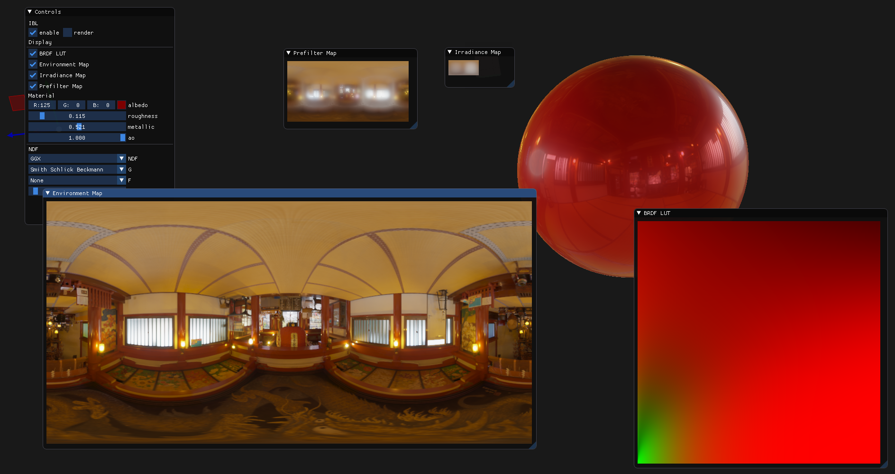
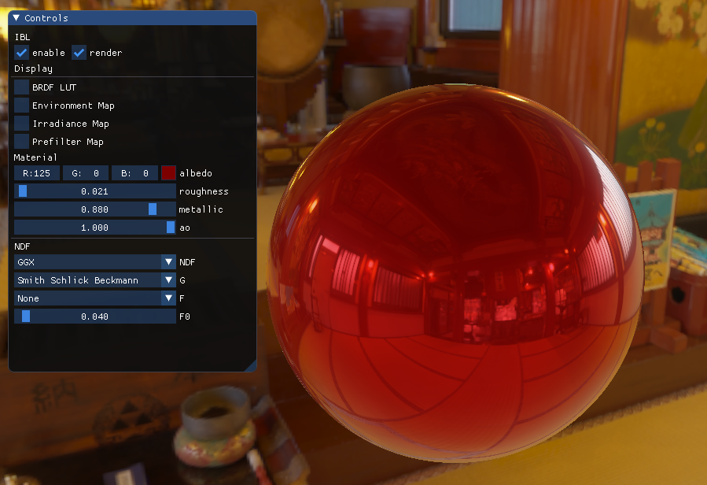
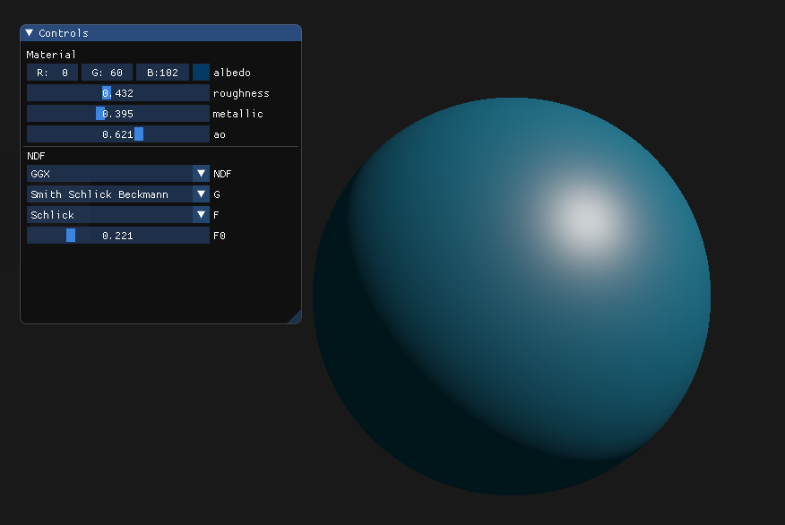
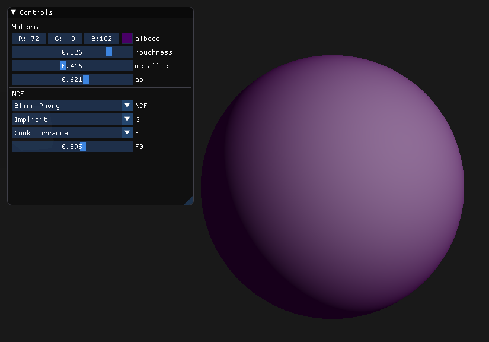

# brdf-explorer
Tool to experiment BRDFs for real-time rendering

## Build
    ```
    > mkdir build
    > cd build
    > cmake ..
    > make -j8
    > ./brdf_explorer
    ```

Hopefully my cmake configurations will take care of all dependencies.

## Features
- select different functions for NDF, Geometric Shadowing and Fresnel terms
- IBL (view and generate textures for IBL)

## TODO
- put some description about the functions
- load custom functions
- in-app function code editor

## Screenshots





